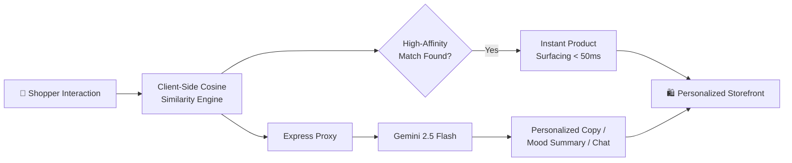

<div align="center">


<br/>

<em>Every shopper sees a different store — the one built just for them.</em>

<br/><br/>

[](https://react.dev/)
[](https://vitejs.dev/)
[](https://www.typescriptlang.org/)
[](https://ai.google.dev/)

<br/>


<br/><br/>

**[Live Demo](#)** &nbsp;·&nbsp; **[Documentation](#-table-of-contents)** &nbsp;·&nbsp; **[Report a Bug](#)** &nbsp;·&nbsp; **[Request a Feature](#)**

</div>

<br/>

---

## 📋 Table of Contents

<table>
<tr>
<td width="50%" valign="top">

- [🎯 The Problem](#-the-problem)
- [💡 The Solution](#-the-solution)
- [✨ Features](#-features)
- [📈 Results](#-results-that-matter)
- [🏗️ How It Works](#️-how-it-works)

</td>
<td width="50%" valign="top">

- [💻 Tech Stack](#-tech-stack)
- [📂 Project Structure](#-project-structure)
- [🚀 Getting Started](#-getting-started)
- [🗺️ Roadmap](#️-roadmap)
- [🤝 Contributing](#-contributing--license)

</td>
</tr>
</table>

<br/>

---

## 🎯 The Problem

<table>
<tr>
<td>

Generic, one-size-fits-all storefronts are quietly killing conversion. When every visitor sees the same catalog in the same order, the result is predictable:

- 📉 **High bounce rates** — nothing feels relevant, so shoppers leave
- 🛑 **Low average order value** — no intelligent nudge toward complementary items
- 😐 **Flat, forgettable browsing** — no sense that the store "gets" the shopper

</td>
</tr>
</table>

<br/>

## 💡 The Solution

AuraStore fuses **deterministic collaborative filtering** with **generative AI reasoning** — the speed of heuristics, the persuasion of natural language.

<table>
<tr>
<td width="33%" align="center">

### ⚡
**Instant**
<br/>
Client-side cosine similarity across catalog tags, computed in real time as shoppers browse

</td>
<td width="33%" align="center">

### 🧠
**Intelligent**
<br/>
Gemini 2.5 Flash turns raw similarity scores into natural, persuasive purchase rationales

</td>
<td width="33%" align="center">

### 💬
**Conversational**
<br/>
Lumi, the AI shopping stylist, recommends and adds items in a live chat experience

</td>
</tr>
</table>

<br/>

---

## ✨ Features

<details open>
<summary><b>🔗 Dynamic Heuristics & Collaborative Filtering</b></summary>
<br/>

Real-time interaction tracking — views, cart activity, search entries — feeds a cosine similarity engine across catalog tags. Products surface based on active category affinity and tag overlap, computed **client-side in under 50ms**.

</details>

<details>
<summary><b>🧠 Generative Refinement with Gemini 2.5</b></summary>
<br/>

Context vectors are sent server-side to **Gemini 2.5 Flash**, which generates natural, one-sentence purchase rationales:

> *"Shoppers who viewed your keyboard setup frequently bundled this cork desk pad to protect their workspace and dampen acoustics."*

</details>

<details>
<summary><b>🛒 Smart Cross-Selling Bundles</b></summary>
<br/>

A co-occurrence matrix isolates high-affinity accessory pairings and displays them as interactive bundles, automatically applying an **18% conversion discount**.

</details>

<details>
<summary><b>🔍 AI Semantic Mood Search</b></summary>
<br/>

A natural-language search bar reads *intent*, not just keywords. Try *"cozy slow morning setup"* and get matched catalog items plus an AI-generated mood summary.

</details>

<details>
<summary><b>💬 Interactive AI Shopping Stylist — Lumi</b></summary>
<br/>

A real-time chat helper that understands shopper needs, suggests catalog items conversationally, and supports one-click add-to-cart directly from the chat window.

</details>

<br/>

### 👥 Simulated Shopper Personas

<div align="center">

| | Persona | Focus Area |
|:---:|---|---|
| 💻 | **Minimalist Developer** | Workspace & audio gear |
| ☕ | **Artisan Home & Coffee Lover** | Cozy decor & kitchen |
| ⚡ | **Performance Biohacker** | Wearables & health |
| 🌟 | **New Anonymous Shopper** | General discovery |

</div>

<br/>

---

## 📈 Results That Matter

<div align="center">

| 📊 Metric | 📈 Impact |
|:---|:---:|
| **Average Order Value** | 🟢 **+18%** |
| **Conversion Rate** | 🟢 **2.4x** |
| **Recommendation Latency** | 🟢 **< 50ms** |
| **AI Response Delivery** | 🟢 **Streaming** |

</div>

<br/>

---

## 🏗️ How It Works



**The flow:**
1. The frontend tracks shopper interactions and computes real-time tag-based similarity across the catalog — entirely client-side.
2. High-affinity products and bundles surface instantly, no network round-trip required.
3. Enriched context vectors are proxied through the Express backend to Gemini 2.5 Flash, keeping the API key secure.
4. Gemini streams back natural-language rationales, mood summaries, and chat responses.

<br/>

---

## 💻 Tech Stack

<div align="center">

| Layer | Technology |
|---|---|
| **Frontend** |    |
| **Backend** |   |
| **AI Core** |  `@google/genai` SDK |
| **UI Extras** | Lucide Icons · Canvas Confetti |

</div>

<br/>

---

## 📂 Project Structure

```bash
├── server.ts                          # Express backend — serves client assets, proxies AI routes
├── src/
│   ├── main.tsx                       # Client entry point
│   ├── App.tsx                        # Core app component (state manager, persona logic, filters)
│   ├── types.ts                       # Shared TypeScript models (Product, Persona, CartItem, Message)
│   ├── index.css                      # Global styles, Tailwind directives, keyframe animations
│   ├── data/
│   │   └── products.ts                # Mock catalog + preconfigured simulation personas
│   └── components/
│       ├── Navbar.tsx                 # Search, persona switcher, telemetry trigger, cart
│       ├── HeroBanner.tsx             # Landing showcase + live persona telemetry card
│       ├── ProductCard.tsx            # Catalog card with ML highlights & labels
│       ├── RecommendationsSection.tsx # AI recommendations shelf + dynamic bundling
│       ├── CartDrawer.tsx             # Cart side-drawer with conversion metrics
│       ├── ChatAssistantDrawer.tsx    # "Lumi" AI styling assistant chatbot
│       ├── ProductDetailModal.tsx     # Full product spec sheet + ML rationale view
│       └── MLMatrixVisualizer.tsx     # Interactive cosine similarity heatmap
```

<br/>

---

## 🚀 Getting Started

### Prerequisites


&nbsp;


### 1️⃣ Clone & Install

```bash
git clone https://github.com/your-username/aurastore.git
cd aurastore
npm install
```

### 2️⃣ Configure Environment

Create a `.env` file at the project root:

```env
GEMINI_API_KEY="YOUR_API_KEY_HERE"
```

### 3️⃣ Run Locally

```bash
npm run dev
```

App runs at `http://localhost:5173` with the Express proxy alongside it.

### 4️⃣ Build for Production

```bash
npm run build
npm run preview   # optional: preview the production build
```

<br/>

---

## 🗺️ Roadmap

- [ ] 🔐 Persistent user accounts & order history
- [ ] 💳 Real payment gateway integration
- [ ] 🧪 A/B testing harness for recommendation strategies
- [ ] 🌐 Multi-language semantic search
- [ ] 📊 Admin dashboard for catalog & bundle management

<br/>

---

## 🤝 Contributing & License

<table>
<tr>
<td width="50%" valign="top">

### Contributing

1. Fork the repository
2. Create a branch: `git checkout -b feature/amazing-feature`
3. Commit: `git commit -m 'Add amazing feature'`
4. Push: `git push origin feature/amazing-feature`
5. Open a Pull Request

</td>
<td width="50%" valign="top">

### License

Distributed under the **MIT License**.
See `LICENSE` for details.

</td>
</tr>
</table>

<br/>

<div align="center">


Built with ❤️ using React, Express & Gemini AI

</div>
